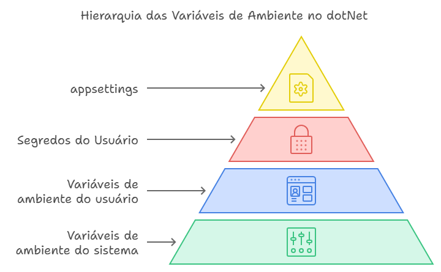

# Lidando com os Segredos do dotNet

Neste artigo, vou compartilhar com vocês algumas coisas que aprendi sobre como gerenciar as variáveis de ambiente no dotNet, graças ao desafio #100DiasDeCodigo.

## Introdução

Quando eu comecei a programar em ambientes Linux, eu costumava usar os arquivos _**.env**_ ou exportar variáveis no Bash para armazenar dados sensíveis, como senhas ou chaves de API. Mas quando eu migrei para o mundo Windows e dotNet, eu descobri que a forma mais comum de fazer isso era usando o arquivo _**appsettings**_, que contém as configurações do projeto. Isso me pareceu muito estranho, pois esse arquivo é normalmente versionado pelo Git, o que pode expor os dados para qualquer pessoa que tenha acesso ao repositório. Além disso, era um trabalho extra ter que remover esses dados antes de fazer um commit.

Por isso, eu optei por usar as variáveis de ambiente do próprio Windows, que são mais seguras e fáceis de configurar. Mas o que eu não sabia é que o dotNet tem uma ferramenta excelente para lidar com os segredos do projeto, que é o User Secrets.

## Hierarquia de Variáveis

O dotNet trabalha com uma hierarquia quando o assunto são as variáveis de ambiente. Isso significa que ele vai procurar o valor de uma variável em diferentes fontes, e vai usar o que tiver a maior prioridade. A ordem é a seguinte:

- Variáveis de ambiente do sistema
- Variáveis de ambiente do usuário
- User Secrets
- appsettings

Portanto, se você definir uma variável de ambiente no sistema ou no usuário, ela vai sobrescrever o valor que estiver no User Secrets ou no appsettings. Isso é útil para quando você quiser mudar alguma configuração sem alterar o código do projeto.

Mas o que são os User Secrets? Eles são um arquivo JSON que armazena os dados sensíveis do projeto, mas que não fica na mesma pasta do projeto, e sim em uma pasta oculta do seu perfil de usuário. Assim, você evita que esses dados sejam versionados pelo Git ou vazados por algum descuido. Você pode acessar esse arquivo pelo Visual Studio ou pela linha de comando.

Trabalhando em um código-fonte aberto, você pode definir apenas o nome das variáveis no seu appsettings para que quem for contribuir com o seu código saiba quais deve configurar. Mas você pode colocar todos os dados sensíveis de desenvolvimento no User Secrets, que pode ser até compartilhado com outras pessoas da equipe (mas não versionado).

E aí podemos deixar as Variáveis de Ambiente só para quando formos rodar os projetos em ambientes de testes e produção.




## Vantagens do User Secrets

Uma das vantagens de usar o User Secrets é que você não precisa reiniciar a IDE toda vez que mudar uma variável de ambiente, como acontece quando você usa as variáveis do Windows. Além disso, você não precisa se preocupar em criar prefixos para diferenciar as variáveis de cada projeto, pois elas ficam separadas por um identificador único (GUID).

Outra vantagem é que você pode compartilhar as configurações com os seus colegas de equipe de forma segura, sem expor os dados sensíveis no repositório do código-fonte.

## Mão no código

Para habilitar o User Secrets no Visual Studio, basta clicar com o botão direito no projeto e selecionar a opção “Gerenciar segredos de usuário”. No Rider, o processo é semelhante. Isso vai criar um arquivo JSON na pasta oculta do seu perfil de usuário, onde você pode armazenar os dados sensíveis do projeto. Você pode copiar e colar o conteúdo do seu appsettings e preencher com os valores que quiser. Simples assim!

Se você estiver usando o VS Code, pode usar a linha de comando para gerenciar os User Secrets. Os comandos são:

```
dotnet user-secrets init #para criar o arquivo de configuração
dotnet user-secrets list #para listar todas as variaveis do projeto
dotnet user-secrets set # para definir uma nova variavel
dotnet user-secrets remove # para remover uma variavel
```

Mas eu acho mais fácil trabalhar diretamente no JSON, que fica armazenado na seguinte pasta:
```
C:\Users\$SEU_USUARIO\AppData\Roaming\Microsoft\UserSecrets\
```

### Alguns detalhes

Um detalhe importante é que o formato das variáveis de ambiente muda de acordo com o sistema operacional. No Windows, usamos dois pontos (:) para separar os níveis das variáveis. No Linux, usamos dois underlines (__).

Por exemplo, se tivermos no JSON:

```Json
"AllowedHosts": "*",
"AppConfig": {
  "ConnectionString": "server=localhost;user=root;password=root;database=MEU-BANCO"
}
```

Para definir a variável de ambiente no Windows, usamos:
```powershell
setx AppConfig:ConnectionString "server=localhost..."
```

E para definir a variável de ambiente no Linux, usamos:
```dotenv
AppConfig__ConnectionString="server=localhost..."
```

Eu pretendo falar mais sobre o uso das variáveis de ambiente nos próximos artigos, que vão tratar de Github Actions.
## Até breve e obrigado pelos peixes.

A conclusão que eu cheguei é que usar o User Secrets é muito vantajoso, pois tudo fica organizado e prático. E o mais importante: sem vazar dados por esquecer de retirá-los antes do commit. Agora é uma das primeiras coisas que eu faço quando inicio um novo projeto.

Espero que essas informações possam ser úteis para vocês também, assim deixo a seguir os links da documentação oficial e do desafio que me inspirou a escrever este artigo.

[Secrets na documentação](https://docs.microsoft.com/pt-br/aspnet/core/security/app-secrets?view=aspnetcore-5.0&tabs=windows)

[100DiasDeCodigo](https://www.100diasdecodigo.dev/)